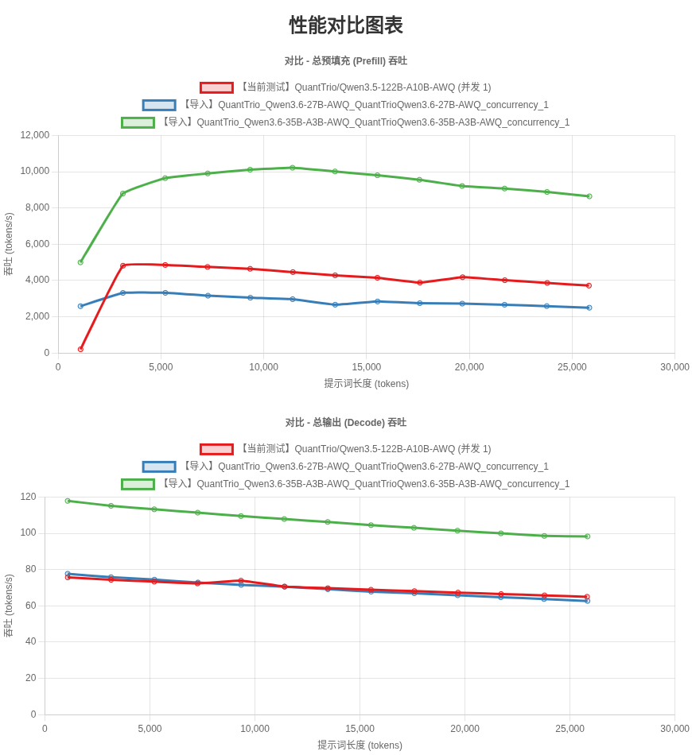

# GooseLLM — vLLM for NVIDIA V100 (SM70)

High-throughput LLM inference on Tesla V100 GPUs building on [1Cat-vLLM-0.0.2](https://github.com/1CatAI/1Cat-vLLM).

This fork adds:

- **TileLang JIT-compiled FlashAttention** — paged prefill kernel covering all attention layers (dense and MoE models). Compiled once per head dim during first request, no offline build step.
- **TileLang-accelerated Gated DeltaNet / Flash Linear Attention** — SM70 kernel paths for hybrid MoE layers (`FLA_USE_TILELANG=1`).
- **Hybrid model support** — automatically handles Qwen3.5-122B-A10B style mixed attention + GatedDeltaNet architectures (1056-token alignment pages split into 16-token sub-pages).
- **Expert parallelism** — `--enable-expert-parallel` for MoE models, works with both AWQ and FP16.
- **FP16 inference** — supports Qwen3.6-35B-A3B and Qwen3.6-27B in FP16 mode (no quantization required).

Upstream FA2 kernel (`csrc/flash_attention_v100/`), SM70 decode kernel, AWQ SM70 autotune, and custom all-reduce remain from the original 1Cat work.

## Acknowledgements

Thanks to [1CatAI](https://github.com/1CatAI/1Cat-vLLM) for the upstream V100 vLLM builds and [tile-ai/tilelang](https://github.com/tile-ai/tilelang) for the TileLang JIT compiler framework.

## Quick Start

### Docker Build

```bash
docker build \
  -f docker/Dockerfile.sm70-build \
  -t goosellm:sm70 \
  .
```

### Local Build

```bash
# Save repo root for later reference
GPP=$(pwd)

# 1. Create and activate environment
conda create -n goosellm python=3.12 -y
conda activate goosellm

# 2. Install dependencies
python -m pip install --upgrade pip setuptools wheel
python -m pip install torch torchvision torchaudio \
    --index-url https://download.pytorch.org/whl/cu128
python -m pip install -r requirements/cuda.txt
python -m pip install 'setuptools>=77.0.3,<81.0.0' 'setuptools_scm>=8' grpcio-tools cmake build

# 3. Set build environment
export CUDA_HOME=/usr/local/cuda-12.8
export PATH=$CUDA_HOME/bin:$PATH
export LD_LIBRARY_PATH=$CUDA_HOME/lib64:${LD_LIBRARY_PATH:-}
export VLLM_TARGET_DEVICE=cuda
export VLLM_MAIN_CUDA_VERSION=12.8
export TORCH_CUDA_ARCH_LIST=7.0
export MAX_JOBS=$(nproc)
export NVCC_THREADS=4

# 4. Clone and install TileLang (JIT compiler, takes ~60s)
git clone https://github.com/tile-ai/tilelang.git ~/tilelang
cd ~/tilelang
git apply "$GPP/patches/tilelang-sm70-bf16.patch"
git apply "$GPP/patches/tilelang-nvcc-optlevel.patch"
cd 3rdparty/tvm
git apply "$GPP/patches/tilelang-tvm-padded-layout.patch"
cd ../..
pip install -e .
cd "$GPP"

# 5. Install TileLang FA-V100 kernels (pure Python, depends on tilelang)
pip install -e 3rdparty/tilelang-fa-v100/

# 6. Build SM70 FA2 kernel (CUDA extension)
cd csrc/flash_attention_v100
sed -i 's/if not torch.cuda.is_available():/if False: # if not torch.cuda.is_available():/' setup.py
python setup.py build_ext --inplace
cd "$GPP"

# 7. Build and install vLLM
rm -rf build vllm.egg-info .deps/*-build .deps/*-subbuild
SETUPTOOLS_SCM_PRETEND_VERSION=0.0.3.dev0 \
  python -m build --wheel --no-isolation --outdir dist-cu128-sm70
python -m pip install dist-cu128-sm70/*.whl --no-deps
```

## Example Serving Commands

Before running any of the commands below, make sure you're in the conda environment:

```bash
conda activate goosellm
```

### MoE Model (Qwen3.6-35B-A3B-AWQ / Qwen3.5-122B-A10B-AWQ)

```bash
FLA_USE_TILELANG=1 NCCL_P2P_LEVEL=NVL \
python -m vllm.entrypoints.openai.api_server \
  --model QuantTrio/Qwen3.6-35B-A3B-AWQ \
  --tensor-parallel-size 4 \
  --dtype float16 \
  --gpu-memory-utilization 0.80 \
  --max-model-len 262144 \
  --max-num-seqs 1 \
  --max-num-batched-tokens 16384 \
  --trust-remote-code \
  --attention-backend FLASH_ATTN_TILELANG_V100 \
  --enable-expert-parallel \
  --skip-mm-profiling \
  --limit-mm-per-prompt '{"image":0,"video":0}' \
  --compilation-config '{"cudagraph_mode":"full_and_piecewise","cudagraph_capture_sizes":[1]}' \
  --host 0.0.0.0 \
  --port 8000
```

### Dense Model (Qwen3.6-27B-AWQ)

```bash
FLA_USE_TILELANG=1 NCCL_P2P_LEVEL=NVL \
python -m vllm.entrypoints.openai.api_server \
  --model QuantTrio/Qwen3.6-27B-AWQ \
  --tensor-parallel-size 4 \
  --dtype float16 \
  --gpu-memory-utilization 0.80 \
  --max-model-len 262144 \
  --max-num-seqs 1 \
  --max-num-batched-tokens 16384 \
  --trust-remote-code \
  --attention-backend FLASH_ATTN_TILELANG_V100 \
  --skip-mm-profiling \
  --limit-mm-per-prompt '{"image":0,"video":0}' \
  --compilation-config '{"cudagraph_mode":"full_and_piecewise","cudagraph_capture_sizes":[1]}' \
  --host 0.0.0.0 \
  --port 8000
```

### Docker MoE (Qwen3.6-35B-A3B-AWQ / Qwen3.5-122B-A10B-AWQ)

```bash
docker run --rm \
  --gpus all \
  --ipc=host \
  -p 8000:8000 \
  -v ~/.cache/huggingface:/root/.cache/huggingface \
  -e NCCL_P2P_LEVEL=NVL \
  -e FLA_USE_TILELANG=1 \
  goosellm:sm70 \
  python -m vllm.entrypoints.openai.api_server \
    --model QuantTrio/Qwen3.6-35B-A3B-AWQ \
    --quantization awq \
    --dtype float16 \
    --gpu-memory-utilization 0.8 \
    --max-model-len 262144 \
    --tensor-parallel-size 4 \
    --max-num-seqs 1 \
    --max-num-batched-tokens 16384 \
    --trust-remote-code \
    --attention-backend FLASH_ATTN_TILELANG_V100 \
    --enable-expert-parallel \
    --skip-mm-profiling \
    --limit-mm-per-prompt '{"image":0,"video":0}' \
    --compilation-config '{"cudagraph_mode":"full_and_piecewise","cudagraph_capture_sizes":[1]}' 
```

### Docker Dense (Qwen3.6-27B-AWQ)

```bash
docker run --rm \
  --gpus all \
  --ipc=host \
  -p 8000:8000 \
  -v ~/.cache/huggingface:/root/.cache/huggingface \
  -e NCCL_P2P_LEVEL=NVL \
  -e FLA_USE_TILELANG=1 \
  goosellm:sm70 \
  python -m vllm.entrypoints.openai.api_server \
    --model QuantTrio/Qwen3.6-27B-AWQ \
    --quantization awq \
    --dtype float16 \
    --gpu-memory-utilization 0.8 \
    --max-model-len 262144 \
    --tensor-parallel-size 4 \
    --max-num-seqs 1 \
    --max-num-batched-tokens 16384 \
    --trust-remote-code \
    --attention-backend FLASH_ATTN_TILELANG_V100 \
    --skip-mm-profiling \
    --limit-mm-per-prompt '{"image":0,"video":0}' \
    --compilation-config '{"cudagraph_mode":"full_and_piecewise","cudagraph_capture_sizes":[1]}'
```

## Results



## Environment Variables

### Attention / Decode

| Variable | Default | Purpose |
|----------|---------|---------|
| `FLA_USE_TILELANG` | `0` | Set to `1` to enable TileLang-accelerated Flash Linear Attention kernels for Gated DeltaNet layers |
| `VLLM_USE_SM70_DECODE` | `1` | Set to `0` to disable SM70 optimized decode kernel |
| `VLLM_SM70_DECODE_VERBOSE` | `0` | Set to `1` for verbose build logs from SM70 decode extension |
| `VLLM_DEBUG_CHECK_NAN` | `0` | Set to `1` to enable NaN/Inf checks in model runner hot path (device→host sync) |
| `FLASH_ATTN_V100_DIR` | — | Override kernel source location for `flash_attn_v100_cuda` |
| `VLLM_TRITON_ATTN_SEQ_THRESHOLD_3D` | — | Sequence threshold for 3D attention grid layout |
| `VLLM_TRITON_ATTN_NUM_PAR_SOFTMAX_SEGMENTS` | — | Number of parallel softmax segments |
| `VLLM_TRITON_ATTN_SM70_QHEAD_SPLIT` | — | SM70 query head split for Triton unified attention |

### Communication / NCCL

| Variable | Default | Purpose |
|----------|---------|---------|
| `VLLM_CUSTOM_ALLREDUCE_ALGO` | — | `1stage` or `2stage` all-reduce for decode |
| `NCCL_P2P_LEVEL` | — | Set to `NVL` to force NVLink for NCCL |
| `VLLM_DISABLE_PYNCCL` | `0` | Set to `1` to disable pynccl (not recommended) |

### Dense FP16 Fastpath

| Variable | Default | Purpose |
|----------|---------|---------|
| `VLLM_SM70_ENABLE_DENSE_F16_FASTPATH` | `0` | Set to `1` to enable SM70 dense FP16 linear fast path |
| `VLLM_SM70_F16_DENSE_MAX_M` | `64` | Max M (token) dimension for dense fastpath |
| `VLLM_SM70_F16_DENSE_DEBUG` | `0` | Debug logging for dense fastpath dispatch |
| `VLLM_SM70_UNQUANT_DEBUG` | `0` | Debug logging for unquantized linear prepare |
| `VLLM_SM70_ENABLE_LM_HEAD_FASTPATH` | `0` | Enable SM70 fast path for LM head |
| `VLLM_SM70_DENSE_CUDAGRAPH_CAPTURE` | `0` | Enable CUDA graph capture for SM70 dense layers |

### MoE / AWQ

| Variable | Default | Purpose |
|----------|---------|---------|
| `VLLM_SM70_AWQ_WARMUP` | `0` | Enable AWQ SM70 autotune warmup for V100 decode shapes |
| `VLLM_SM70_AWQ_WARMUP_MAX_M` | — | Max M dimension for AWQ warmup |
| `VLLM_SM70_AWQ_WARMUP_MAX_MOE_TOKENS` | — | Max MoE tokens for AWQ warmup |
| `VLLM_SM70_AWQ_DENSE_TUNE_MAX_M` | — | Max M for AWQ dense autotune |
| `VLLM_SM70_AWQ_MOE_TUNE_MAX_TOKENS` | — | Max tokens for AWQ MoE autotune |
| `VLLM_SM70_AWQ_TUNE_SMALL_SHAPES` | `0` | Tune small shapes during AWQ autotune |
| `VLLM_SM70_AWQ_ENABLE_SINGLE_TOKEN_COMPACT` | `0` | Enable single-token compact for AWQ MoE |
| `VLLM_SM70_AWQ_COMPACT_COMPARE` | `0` | Compare AWQ compact outputs against reference |
| `VLLM_SM70_GEMM_LUT_PATH` | — | Path to GEMM lookup table for SM70 AWQ |
| `VLLM_SM70_GATE_UP_GATED_SILU` | `0` | Enable gated SiLU epilogue for MoE gate/up projections |
| `VLLM_SM70_SHARED_GATE_MAX_M` | — | Max M for shared expert gate in Qwen2 MoE |

### MoE FP16

| Variable | Default | Purpose |
|----------|---------|---------|
| `VLLM_SM70_MOE_SINGLE_TOKEN_FASTPATH` | `0` | Enable single-token MoE FP16 fast path |
| `VLLM_SM70_MOE_SINGLE_TOKEN_PERMUTE_FASTPATH` | `0` | Enable single-token MoE permute fast path |
| `VLLM_SM70_MOE_SINGLE_TOKEN_UNPERMUTE_FASTPATH` | `0` | Enable single-token MoE unpermute fast path |
| `VLLM_SM70_FP16_MOE_VERIFY` | `0` | Verify FP16 MoE outputs against reference |

### GDN / FLA (Gated Delta Network / Flash Linear Attention)

Tuning knobs for SM70 linear attention kernel launch configurations.

| Variable | Purpose |
|----------|---------|
| `VLLM_SM70_GDN_CHUNK_O_BK` | Chunk O block size (K dimension) |
| `VLLM_SM70_GDN_CHUNK_O_BV` | Chunk O block size (V dimension) |
| `VLLM_SM70_GDN_CHUNK_O_WARPS` | Chunk O warps per block |
| `VLLM_SM70_GDN_CHUNK_O_STAGES` | Chunk O pipeline stages |
| `VLLM_SM70_GDN_DELTA_H_BV` | Delta H block size (V dimension) |
| `VLLM_SM70_GDN_DELTA_H_WARPS` | Delta H warps per block |
| `VLLM_SM70_GDN_DELTA_H_STAGES` | Delta H pipeline stages |
| `VLLM_SM70_GDN_KDA_WARPS` | KDA warps per block |
| `VLLM_SM70_GDN_KDA_STAGES` | KDA pipeline stages |
| `VLLM_SM70_GDN_KKT_BK` | KKT block size (K dimension) |
| `VLLM_SM70_GDN_KKT_WARPS` | KKT warps per block |
| `VLLM_SM70_GDN_WY_FAST_WARPS` | WY Fast warps per block |
| `VLLM_SM70_GDN_WY_FAST_STAGES` | WY Fast pipeline stages |
| `VLLM_SM70_FLA_BV` | FLA block size (V dimension) |
| `VLLM_SM70_FLA_WARPS` | FLA warps per block |
| `VLLM_SM70_FLA_STAGES` | FLA pipeline stages |
| `VLLM_SM70_FLA_TARGET_WAVES` | FLA target wave occupancy |
| `VLLM_SM70_FLA_BV_CANDIDATES` | FLA BV candidate values (comma-separated) |

### Debug / Trace

| Variable | Default | Purpose |
|----------|---------|---------|
| `VLLM_QWEN3_NEXT_SM70_TRACE` | `0` | Enable SM70 trace logging for Qwen3 Next model |
| `VLLM_DEBUG_MTP_LOAD` | `0` | Debug MTP (Multi-Token Prediction) weight loading |
| `VLLM_DEBUG_MTP_LOAD_VERBOSE` | `0` | Verbose MTP load debug |
| `VLLM_DEBUG_CHECK_NAN` | `0` | Same as above — gate NaN/Inf hot-path checks |

## References

- Original V100 kernel research: [ai-bond/flash-attention-v100](https://github.com/ai-bond/flash-attention-v100)
- Upstream vLLM: [1CatAI/1Cat-vLLM](https://github.com/1CatAI/1Cat-vLLM)
